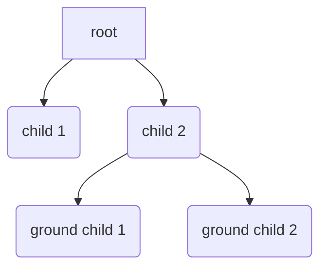

# AsyncKivy

[Youtube](https://www.youtube.com/playlist?list=PLNdhqAjzeEGjTpmvNck4Uykps8s9LmRTJ)  
[日本語doc](README_jp.md)  

`asynckivy` is an async library that saves you from ugly callback-based code,
like most of async libraries do.
Let's say you want to do:

1. `print('A')`
1. wait for 1sec
1. `print('B')`
1. wait for a button to be pressed
1. `print('C')`

in that order.
Your code would look like this:

```python
from kivy.clock import Clock

def what_you_want_to_do(button):
    print('A')

    def one_sec_later(__):
        print('B')
        button.bind(on_press=on_button_press)
    Clock.schedule_once(one_sec_later, 1)

    def on_button_press(button):
        button.unbind(on_press=on_button_press)
        print('C')

what_you_want_to_do(...)
```

It's not easy to understand.
If you use `asynckivy`, the above code will become:

```python
import asynckivy as ak

async def what_you_want_to_do(button):
    print('A')
    await ak.sleep(1)
    print('B')
    await ak.event(button, 'on_press')
    print('C')

ak.start(what_you_want_to_do(...))
```

## Installation

It's recommended to pin the minor version, because if it changed, it means some *important* breaking changes occurred.

```text
poetry add asynckivy@~0.5
pip install "asynckivy>=0.5,<0.6"
```

## Usage

```python
import asynckivy as ak

async def some_task(button):
    # wait for 1sec
    dt = await ak.sleep(1)
    print(f'{dt} seconds have passed')

    # wait until a button is pressed
    await ak.event(button, 'on_press')

    # wait until 'button.x' changes
    __, x = await ak.event(button, 'x')
    print(f'button.x is now {x}')

    # wait until 'button.x' becomes greater than 100
    if button.x <= 100:
        __, x = await ak.event(button, 'x', filter=lambda __, x: x>100)
        print(f'button.x is now {x}')

    # wait until EITHER a button is pressed OR 5sec passes.
    # i.e. wait at most 5 seconds for a button to be pressed
    tasks = await ak.wait_any(
        ak.event(button, 'on_press'),
        ak.sleep(5),
    )
    print("The button was pressed" if tasks[0].finished else "Timeout")

    # wait until a button is pressed AND 5sec passes.
    tasks = await ak.wait_all(
        ak.event(button, 'on_press'),
        ak.sleep(5),
    )

    # nest as you want.
    # wait for a button to be pressed AND (5sec OR 'other_async_func' to complete)
    tasks = await ak.wait_all(
        ak.event(button, 'on_press'),
        ak.wait_any(
            ak.sleep(5),
            other_async_func(),
        ),
    )
    child_tasks = tasks[1].result
    print("5sec passed" if child_tasks[0].finished else "other_async_func has completed")

ak.start(some_task(some_button))
```

### animation

```python
from types import SimpleNamespace
import asynckivy as ak

async def async_func(widget1, widget2):
    obj = SimpleNamespace(attr1=10, attr2=[20, 30, ], attr3={'key': 40, })

    # Animate attibutes of any object and wait for it to end.
    await ak.animate(obj, attr1=200, attr2=[200, 100], attr3={'key': 400})

    # Interpolate between two values in an async-manner.
    async for v in ak.interpolate(0, 200):
        print(v)
        # await something  # DO NOT await anything during this loop

    # fade-out widgets, excute the with-block, fade-in widgets.
    async with ak.fade_transition(widget1, widget2):
        widget.text = 'new text'
        widget2.y = 200

    # If you want more low-level control over animations, use the vanim module.
    # Read the module doc for details.
    from asynckivy import vanim
    async for dt in vanim.delta_time():
        ...
```

### touch handling

You can easily handle `on_touch_xxx` events via `asynckivy.rest_of_touch_moves()`.

```python
class TouchReceiver(Widget):
    def on_touch_down(self, touch):
        if self.collide_point(*touch.opos):
            ak.start(self.handle_touch(touch))
            return True

    async def handle_touch(self, touch):
        print('on_touch_up')
        async for __ in ak.rest_of_touch_moves(self, touch):
            # await something  # DO NOT await anything during this loop
            print('on_touch_move')
        print('on_touch_up')
```

If Kivy is running in asyncio/trio mode, `rest_of_touch_moves()` might not work.
In that case, use `watch_touch()`.

```python
import asynckivy as ak

class TouchReceiver(Widget):
    def on_touch_down(self, touch):
        if self.collide_point(*touch.opos):
            ak.start(self.handle_touch(touch))
            return True
        return super().on_touch_down(touch)

    async def handle_touch(self, touch):
        print('on_touch_up')
        async with ak.watch_watch(self, touch) as in_progress:
            # DO NOT await anything inside this with-block except the return value of 'in_progress()'.
            while await in_progress():
                print('on_touch_move')
        print('on_touch_up')
```

### threading

`asynckivy` does not have any I/O primitives like Trio and asyncio do,
thus threads are the only way to perform them without blocking the main-thread:

```python
from concurrent.futures import ThreadPoolExecutor
import asynckivy as ak

executor = ThreadPoolExecutor()


def thread_blocking_operation():
    '''This function is called from outside the main-thread, so you are not allowed to touch gui components here.'''


async def some_task():
    # create a new thread, run a function inside it, then
    # wait for the completion of that thread
    r = await ak.run_in_thread(thread_blocking_operation)
    print("return value:", r)

    # run a function inside a ThreadPoolExecutor, and wait for the completion
    # (ProcessPoolExecutor is not supported)
    r = await ak.run_in_executor(executor, thread_blocking_operation)
    print("return value:", r)
```

Exceptions(not BaseExceptions) are propagated to the caller
so you can catch them like you do in synchronous code:

```python
import requests
import asynckivy as ak

async def some_task(label):
    try:
        response = await ak.run_in_thread(lambda: requests.get('htt...', timeout=10))
    except requests.Timeout:
        label.text = "TIMEOUT!"
    else:
        label.text = "RECEIVED: " + response.text
```

### synchronizing and communicating between tasks

There is a [asyncio.Event](https://docs.python.org/3/library/asyncio-sync.html#asyncio.Event) equivalent.

```python
import asynckivy as ak

async def task_A(e):
    print('A1')
    await e.wait()
    print('A2')
async def task_B(e):
    print('B1')
    await e.wait()
    print('B2')

e = ak.Event()
ak.start(task_A(e))
# A1
ak.start(task_B(e))
# B1
e.set()
# A2
# B2
```

Unlike Trio's and asyncio's, when you call ``Event.set()``,
the tasks waiting for it to happen will *immediately* be resumed.
As a result, ``e.set()`` will return *after* ``A2`` and ``B2`` are printed.

### dealing with cancellations

``asynckivy.start()`` returns a ``Task``,
which can be used to cancel the execution.

```python
task = asynckivy.start(async_func())
...
task.cancel()
```

When `.cancel()` is called, a `Cancelled` exception will occur inside the task,
which means you can prepare for cancellations as follows:

```python
async def async_func():
    try:
        ...
    except Cancelled:
        print('cancelled')
        raise  # You must re-raise !!
    finally:
        print('cleanup resources here')
```

You are not allowed to `await` inside `except-Cancelled-clause` and `finally-clause` if you want the task to be cancellable
because cancellations always must be done immediately.

```python
async def async_func():
    try:
        await something  # <-- ALLOWED
    except Exception:
        await something  # <-- ALLOWED
    except Cancelled:
        await something  # <-- NOT ALLOWED
        raise
    finally:
        await something  # <-- NOT ALLOWED
```

You are allowed to `await` inside `finally-clause` if the task will never get cancelled.

```python
async def async_func():  # Assuming this never gets cancelled
    try:
        await something  # <-- ALLOWED
    except Exception:
        await something  # <-- ALLOWED
    finally:
        await something  # <-- ALLOWED
```

As long as you follow the above rules, you can cancel tasks as you wish.
But note that if there are lots of explicit calls to `Task.cancel()` in your code,
**it's a sign of your code being not well-structured**.
You can usually avoid it by using `asynckivy.wait_all()` and `asynckivy.wait_any()`.  

## Notes

### Places you cannot await

I already mentioned about this but I'll say again.
**You cannot await while iterating `rest_of_touch_moves()` or `interpolate()`.**

```python
import asynckivy as ak

async def async_fn():
    async for v in ak.interpolate(...):
        await something  # <-- NOT ALLOWED

    async for __ in ak.rest_of_touch_moves(...):
        await something  # <-- NOT ALLOWED
```

### Some of features might not work if Kivy is running in asyncio/trio mode

`asyncio` and `trio` do some hacky stuff, `sys.set_asyncgen_hooks()` and `sys.get_asyncgen_hooks`,
which likely hinders asynckivy-flavored async generators.
You can see its details [here](https://peps.python.org/pep-0525/#finalization).

Because of that, the features that create async generators might not work perfectly.
Here is a list of them:

- `rest_of_touch_moves()`
- the entire `vanim` module
- `fade_transition()`

I don't know how to make it work.
Maybe if [PEP355](https://peps.python.org/pep-0533/) is accepted,
it might work.

### Structured Concurrency

(This section is incomplete, and will be filled some day.)

`asynckivy.wait_all()` and `asynckivy.wait_any()` follow the concept of [structured concurrency][njs_sc].

```python
import asynckivy as ak

async def root():
    await ak.wait_any(child1(), child2())

async def child1():
    ...

async def child2():
    await ak.wait_all(ground_child1(), ground_child2())

async def ground_child1():
    ...

async def ground_child2():
    ...
```




## Tested on

- CPython 3.8 + Kivy 2.2.1
- CPython 3.9 + Kivy 2.2.1
- CPython 3.10 + Kivy 2.2.1
- CPython 3.11 + Kivy 2.2.1

## Why this even exists

Kivy supports two legit async libraries, [asyncio][asyncio] and [Trio][trio], from version 2.0.0 so developing another one seems [reinventing the wheel][reinventing].
Actually, I started this one just for learning how async/await works so it *was* initially "reinventing the wheel".

But after playing with Trio and Kivy for a while, I noticed that Trio is not suitable for the situation where fast reactions are required e.g. touch events.
The same is true of asyncio.
You can confirm it by running `investigation/why_xxx_is_not_suitable_for_handling_touch_events.py`, and mashing a mouse button.
You'll see sometimes `up` is not paired with `down`.
You'll see the coordinates aren't relative to the `RelativeLayout` even though the `target` belongs to it.

The cause of those problems is that `trio.Event.set()` and `asyncio.Event.set()` don't *immediately* resume the tasks waiting for the `Event` to be set. They just schedule the tasks to resume.
Same thing can be said to `nursery.start_soon()` and `asyncio.create_task()`.

Trio and asyncio are async **I/O** libraries after all. They probably don't have to immediately resumes/starts tasks, which I think necessary for Kivy's touch handling.
(If a touch is not handled immediately, its coordinate's origin may change, its `pos` might be updated and the previous value will be lost.)
Their core design might not be suitable for GUI in the first place.
That's why I'm still developing this `asynckivy` library to this day.

[asyncio]:https://docs.python.org/3/library/asyncio.html
[trio]:https://trio.readthedocs.io/en/stable/
[reinventing]:https://en.wikipedia.org/wiki/Reinventing_the_wheel
[njs_sc]:https://vorpus.org/blog/notes-on-structured-concurrency-or-go-statement-considered-harmful/
