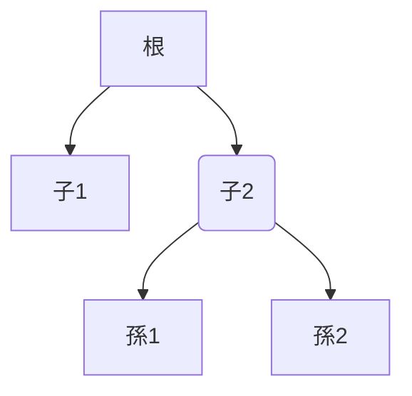

# AsyncKivy

[Youtube](https://www.youtube.com/playlist?list=PLNdhqAjzeEGjTpmvNck4Uykps8s9LmRTJ)

`asynckivy`はKivy用のlibraryで、
よくあるasync libraryと同じでcallback関数だらけの醜いcodeを読みやすくしてくれます。
例えば

1. `A`を出力
1. 一秒待機
1. `B`を出力
1. buttonが押されるまで待機
1. `C`を出力

といった事を普通にやろうとするとcodeは

```python
from kivy.clock import Clock

def what_you_want_to_do(button):
    print('A')

    def one_sec_later(__):
        print('B')
        button.bind(on_press=on_button_press)
    Clock.schedule_once(one_sec_later, 1)

    def on_button_press(button):
        button.unbind(on_press=on_button_press)
        print('C')

what_you_want_to_do(...)
```

のように読みにくい物となりますが、`asynckivy`を用いることで

```python
import asynckivy as ak

async def what_you_want_to_do(button):
    print('A')
    await ak.sleep(1)
    print('B')
    await ak.event(button, 'on_press')
    print('C')

ak.start(what_you_want_to_do(...))
```

と分かりやすく書けます。

## Install方法

このmoduleのminor versionが変わった時は何らかの重要な互換性の無い変更が加えられた可能性が高いので、使う際はminor versionまでを固定してください。

```text
poetry add asynckivy@~0.5
pip install "asynckivy>=0.5,<0.6"
```

## 使い方

```python
import asynckivy as ak

async def async_func(button):
    # 1秒待つ
    dt = await ak.sleep(1)
    print(f'{dt}秒経ちました')

    # buttonが押されるまで待つ
    await ak.event(button, 'on_press')

    # 'button.x'の値が変わるまで待つ
    __, x = await ak.event(button, 'x')
    print(f'button.x の現在の値は {x} です')

    # 'button.x'の値が100を超えるまで待つ
    if button.x <= 100:
        __, x = await ak.event(button, 'x', filter=lambda __, x: x>100)
        print(f'button.x の現在の値は {x} です')

    # buttonが押される か 5秒経つまで待つ
    tasks = await ak.wait_any(
        ak.event(button, 'on_press'),
        ak.sleep(5),
    )
    print("buttonが押されました" if tasks[0].finished else "5秒経ちました")

    # buttonが押され なおかつ 5秒経つまで待つ
    tasks = await ak.wait_all(
        ak.event(button, 'on_press'),
        ak.sleep(5),
    )

    # buttonが押され なおかつ (5秒経つ か 'other_async_func'が完了する) まで待つ
    tasks = await ak.wait_all(
        ak.event(button, 'on_press'),
        ak.wait_any(
            ak.sleep(5),
            other_async_func(),
        ),
    )
    child_tasks = tasks[1].result
    print("5秒経ちました" if child_tasks[0].finished else "other_async_funcが完了しました")

ak.start(async_func(a_button))
```

### animation関連

```python
from types import SimpleNamespace
import asynckivy as ak


async def async_func(widget1, widget2):
    obj = SimpleNamespace(attr1=10, attr2=[20, 30, ], attr3={'key': 40, })

    # 任意のobjectの属性をanimationしてその完了を待つ。
    await ak.animate(obj, attr1=200, attr2=[200, 100], attr3={'key': 400})

    # 二つの数値を補間する。
    async for v in ak.interpolate(0, 200):
        print(v)
        # await something  # この繰り返し中にawaitは使ってはいけない

    # duration/2秒かけてwidget達を徐々に透明にしてからwith blobk内を実行し、それから
    # duration/2秒かけて元の透明度に戻す。透明度の更新はstep秒毎に行う。
    async with ak.fade_transition(widget1, widget2):
        widget1.text = 'new text'
        widget2.y = 200

    # より細やかにanimationを制御したい時の為に vanim があります。詳しくはmoduleのdocを。
    from asynckivy import vanim
    async for dt in vanim.delta_time():
        ...
```

### touch処理

`asynckivy.rest_of_touch_moves()`を用いる事で簡単に`on_touch_xxx`系のeventを捌く事ができる。

```python
import asynckivy as ak

class TouchReceiver(Widget):
    def on_touch_down(self, touch):
        if self.collide_point(*touch.opos):
            ak.start(self.handle_touch(touch))
            return True

    async def handle_touch(self, touch):
        print('on_touch_up')
        async for __ in ak.rest_of_touch_moves(self, touch):
            # この繰り返し中はawaitを使ってはいけない。
            print('on_touch_move')
        print('on_touch_up')
```

Kivyがasyncio/trioモードで動いていると`rest_of_touch_moves()`がうまく動かない可能性があります。
そんな時は`watch_touch()`を使って下さい。

```python
import asynckivy as ak

class TouchReceiver(Widget):
    def on_touch_down(self, touch):
        if self.collide_point(*touch.opos):
            ak.start(self.handle_touch(touch))
            return True
        return super().on_touch_down(touch)

    async def handle_touch(self, touch):
        print('on_touch_up')
        async with ak.watch_watch(self, touch) as in_progress:
            # このwithブロック内で 'in_progress()' の戻り値以外の物をawaitしてはならない。
            while await in_progress():
                print('on_touch_move')
        print('on_touch_up')
```

### thread

`asynckivy`はTrioやasyncioのような入出力機能を持たないので、GUIを固まらせずにそれをしたければ別のthreadで行うしかない。今のところ次の二つの方法がある。

```python
from concurrent.futures import ThreadPoolExecuter
import asynckivy as ak

executer = ThreadPoolExecuter()


def thread_blocking_operation():
    '''この関数は main-thread の外から呼ばれるので ここでKivyのGUIに触れてはならない。'''


async def async_func():
    # 方法その一
    # 新しくthreadを作ってそこで渡された関数を実行し、その完了を待つ
    r = await ak.run_in_thread(thread_blocking_operation)
    print("return value:", r)

    # 方法そのニ
    # ThreadPoolExecuterで渡された関数を実行し、その完了を待つ
    r = await ak.run_in_executer(executer, thread_blocking_operation)
    print("return value:", r)
```

thread内で起きた例外(ExceptionではないBaseExceptionは除く)は呼び出し元に運ばれるので、
以下のように通常の同期codeを書く感覚で例外を捌ける。

```python
import requests
import asynckivy as ak

async def async_func(label):
    try:
        response = await ak.run_in_thread(lambda: requests.get('htt...', timeout=10))
    except requests.Timeout:
        label.text = "制限時間内に応答無し"
    else:
        label.text = "応答有り: " + response.text
```

### Task間の連絡および同期

[asyncio.Event](https://docs.python.org/3/library/asyncio-sync.html#asyncio.Event)相当の物。

```python
import asynckivy as ak

async def task_A(e):
    print('A1')
    await e.wait()
    print('A2')
async def task_B(e):
    print('B1')
    await e.wait()
    print('B2')

e = ak.Event()
ak.start(task_A(e))
# A1
ak.start(task_B(e))
# B1
e.set()
# A2
# B2
```

Trioやasyncioの物とは違って``Event.set()``が呼ばれた時それを待っているtaskは即座に再開される。
なので上の例で``e.set()``は``A2``と``B2``が出力された後に処理が戻る。

[asyncio.Queue](https://docs.python.org/3/library/asyncio-queue.html)相当の物.

```python
from kivy.app import App
import asynckivy as ak
from asynckivy.queue import Queue

async def producer(q, items):
    for i in items:
        await q.put(i)
    q.close()

async def consumer(q):
    assert ''.join([item async for item in q]) == 'ABCD'  # Queueはasync-iterable

async def consumer2(q):
    '''上の ``consumer()`` と同等のコード'''
    items = []
    try:
        while True:
            items.append(await q.get())
    except ak.EndOfResource:
        assert ''.join(items) == 'ABCD'


q = Queue()
ak.start(producer(q, 'ABCD'))
ak.start(consumer(q))
App().run()  # QueueはClockに依存しているのでevent-loopを回してあげないと動作しない。
```

### 中断への対処

``asynckivy.start()``が返した``Task``の``.cancel()``を呼ぶ事で処理を中断できる。

```python
task = asynckivy.start(async_func())
...
task.cancel()
```

その際`async_func()`の中で`Cancelled`例外が起きるので以下のように書けば中断に備えたコードになる。

```python
async def async_func():
    try:
        ...
    except Cancelled:
        # 中断が行われた時にだけ行いたい処理をここに書くと良い。
        ...
        raise  # Cancelled例外を揉み消してはならない!!
    finally:
        # ここで何か後始末をすると良い
```

また中断は常に速やかに完遂させないといけないので、except-Cancelled節とfinally節の中で`await`する事は許されない。

```python
async def async_func():
    try:
        await something  # <-- 良い
    except Exception:
        await something  # <-- 良い
    except Cancelled:
        await something  # <-- 駄目
        raise
    finally:
        await something  # <-- 駄目
```

逆にいうと中断されないのであればfinally節で`await`しても良い。

```python
async def async_func():
    try:
        await something  # <-- 良い
    except Exception:
        await something  # <-- 良い
    finally:
        await something  # <-- 良い (中断されない前提)
```

上の決まりを守っている限りは好きなだけ中断できる。
ただもし明示的な``.cancel()``呼び出しがcode内に多く現れるようなら、
それはcodeが正しい構造を採っていない兆しなので修正すべきである。
多くの場合``Task.cancel()``は`asynckivy.wait_all()`や`asynckivy.wait_any()`を用いる事で無くせるのでそうするのがお薦めです。

## 留意点

### awaitできない場所

既に上で述べたことですが再び言います。
`rest_of_touch_moves()`や`interpolate()`による繰り返し中は`await`してはいけません。

```python
import asynckivy as ak

async def async_fn():
    async for v in ak.interpolate(...):
        await something  # 駄目

    async for __ in ak.rest_of_touch_moves(...):
        await something  # 駄目
```

### Kivyがasyncio/trioモードで動いている時はasynckivyはうまく機能しないかもしれません

`asyncio`や`trio`がasync generatorに対して[付け焼き刃的な処置](https://peps.python.org/pep-0525/#finalization)を行うせいなのか、asynckivy用のasync generatorがうまく機能しない事があります。
なので`asyncio`または`trio`を使っている場合は以下の者達を使わなのがお薦めです。

- `rest_of_touch_moves()`
- `vanim` モジュールの全て
- `fade_transition()`

これにどう対処すればいいのかは現状分かっていません。
もしかすると[PEP533](https://peps.python.org/pep-0533/)が解決してくれるかもしれません。

### Structured Concurrency

(この章はまだ未完成。)

`asynckivy.wait_all()`と`asynckivy.wait_any()`は[structured concurrency][sc]の考え方に従っています。

<!--
関連性の無いファイルがたくさん(例えば数千個)あったとして、それらを全て一つのフォルダに入れて管理する人は少ないと思います。
多くの人はそれらを自分なりの基準(日付、ファイルの種類、属するプロジェクト)で別にフォルダを作って小分けしていくでしょう。
同じ事が並行処理にもいえます。
`asyncio.create_task()`や`asynckivy.start()`や`threading.Thread.start()`等で立ち上げたtaskはフォルダに属していないファイルも同然であり
-->

```python
import asynckivy as ak

async def 根():
    await ak.wait_any(子1(), 子2())

async def 子1():
    ...

async def 子2():
    await ak.wait_all(孫1(), 孫2())

async def 孫1():
    ...

async def 孫2():
    ...
```



## Test環境

- CPython 3.8 + Kivy 2.2.1
- CPython 3.9 + Kivy 2.2.1
- CPython 3.10 + Kivy 2.2.1
- CPython 3.11 + Kivy 2.2.1

[sc]:https://qiita.com/gotta_dive_into_python/items/6feb3224a5fa572f1e19
